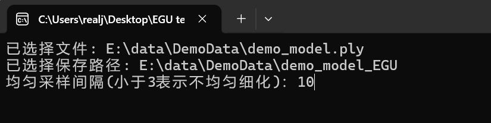
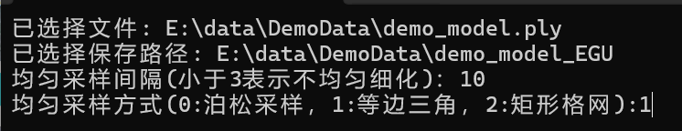
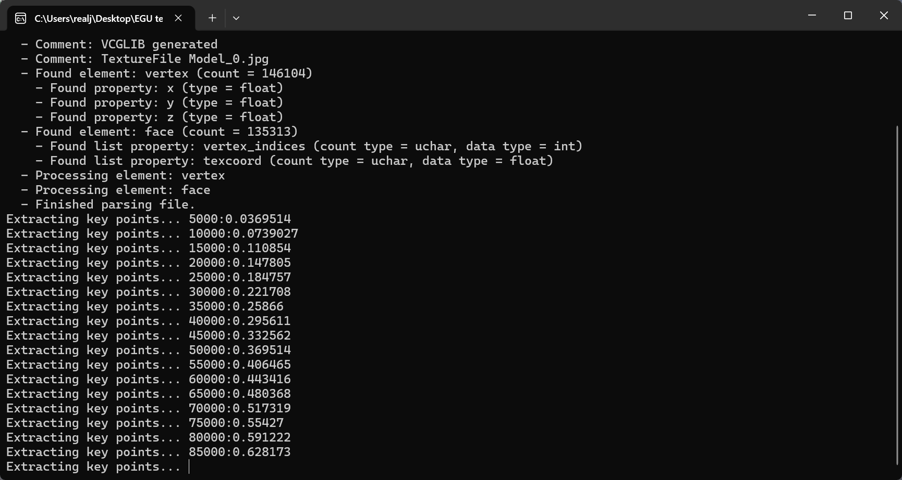

# README

# Edge‑Guided Uniform (EGU) Mesh Refinement Tool

**A desktop tool for refining photogrammetric 3D meshes .**

## 📥 Download

The Windows executable (including all required DLLs) is available as a compressed archive from the Releases page.

- Download the latest `EGU_test.zip`
- Extract the archive to any folder
- Run `EGU_demo.exe`

> ⚠️ **System Requirement**: Windows 10/11, 64-bit. If you encounter missing DLL errors, please install [Microsoft Visual C++ Redistributable](https://aka.ms/vs/17/release/vc_redist.x64.exe).

## 🚀 Quick Start with Demo Data

To help you get started, we provide a **demo dataset** containing a small textured mesh (`model.obj` + `texture.png`). You can download it along with the executable from the Releases page, or use your own PLY data.

**Step‑by‑step tutorial:**

### 1️⃣ Set Input and Output Paths

Launch `EGU_test.exe`. 

- **Input Mesh**:Select your `.ply` file (e.g., `model.ply`).
- **Output Mesh**: Specify the output path and filename for the refined mesh (e.g., `refined_model.ply`).

> 💡 The tool preserves the original geometry and texture — only the mesh topology (triangulation) is refined.

### 2️⃣ Set Sampling Interval (Mesh Density)

The **Sampling Interval** (in pixels) controls the density of the refined mesh:

- A **smaller value** (e.g., 10) produces a denser mesh with finer triangles, better aligned to semantic boundaries.
- A **larger value** (e.g., 25) produces a coarser mesh with fewer triangles.

> ⚠️ **Special case**: If the interval is set to **less than 3 pixels**, the uniform sampling is **disabled**, and only **Edge‑Guided (EG) refinement** is applied — i.e., texture edges are used as constraints, but no additional vertices are inserted to regularize triangle shapes.

### 3️⃣ Choose Uniform Sampling Mode

The tool supports three sampling strategies to generate spatially uniform vertices inside each triangle:

| Mode                            | Description                                                | Recommended For                                              |
| :------------------------------ | :--------------------------------------------------------- | :----------------------------------------------------------- |
| **Equilateral Triangular Grid** | Generates a regular grid of equilateral triangles.         | **Default & recommended** (used in our paper). Produces the most regular mesh. |
| **Rectangular Grid**            | Generates a grid aligned with the triangle's bounding box. | Scenes where rectangular patterns are prevalent (e.g., buildings). |
| **Poisson Disk Sampling**       | Generates a blue‑noise distribution of vertices.           | Scenes requiring more stochastic, less structured sampling.  |

> 📌 **Our paper adopts the Equilateral Triangular Grid** for its superior regularity and stable feature aggregation in downstream segmentation tasks.

### 4️⃣ Start Refinement

The tool will:

1. Extract texture edges using LSD line detection.
2. Apply uniform sampling based on your selected mode and interval.
3. Perform constrained Delaunay remeshing.
4. Reproject texture coordinates onto the refined mesh.

Upon completion, you will see a success message:

The refined mesh is saved to your specified output path and can be opened in any 3D viewer (e.g., MeshLab, CloudCompare).

## 📂 Example Data

We provide a small demo dataset (`DemoData.zip`) to test the tool. It includes:

- `model.obj` – a small textured mesh
- `texture.png` – the corresponding texture image
- `ground_truth.png` – semantic annotations (for reference)

You can download `DemoData.zip` from the Releases page, extract it, and follow the steps above.
